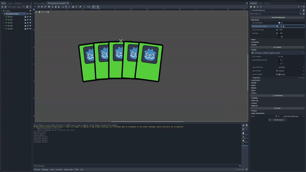

 

# Godot Card Control

  

A Godot plugin providing a lightweight solution for card game layouts. Currently in beta phase. Please report issues through the GitHub issue channel.

## Features
- Control node for laying out cards in a hand layout.
- View hand layout directly in the editor.
- Configurable hover animation.
- Node-free solution for providing layout information for a hand layout.
- Dragging cards.(Beta)

## Installation
See [Installation Guide](./documents/INSTALLATION.md).

## Tutorial
See [Tutorial](./documents/TUTORIAL.md)

## License
This plugin is under the MIT license. Find the license file [here](./addons/godot_card_layout/LICENSE.md).